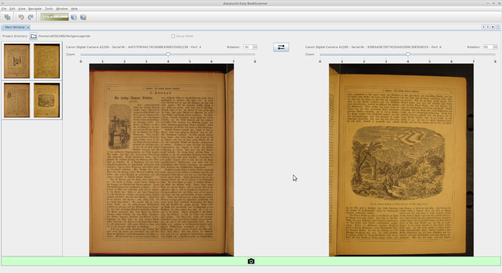

# Eazy BookScanner

OpenSource Book Scanner application for digitizing books with two cameras.
Usage for two digital cameras like described at <http://diybookscanner.org/>.



## Features

* Supported output image formats: JPG, TIF, PNG
* Setup Mode: take unsaved test pictures for adjusting/exchanging left/right camera, image rotation and zoom before starting production shots with save
* Synchronous two camera shots

## Requirements

* Java 1.8 or above

## Installation

* Download ZIP from <https://github.com/datazuul/eazy-bookscanner/tree/main/dist>
* Unzip into installation destination.

## Usage

* Connect cameras to USB-ports
* Turn on cameras
* Change into installation directory of Eazy BookScanner
* Run `bin/eazybookscanner`
* Open project folder (target directory for images)
* Take test shots in "Setup Mode" until adjustings and desired setup (left/right, zoom, rotation) are feasible
* Uncheck "Setup Mode"
* Start scanning

## Supported cameras

* CHDK Canon Digital cameras

```
WARNING: Using this software is at your own risk!

See also https://chdk.fandom.com/wiki/FAQ:
"CHDK comes with no warranty for any use; you use it at your own risk."
```

Successfully tested on:

|Camera Vendor (Id)|Product (Id)|Operating System|Java Version|
|-----|-----|-----|-----|
|Canon (0x04a9)|A2200 (0x322a)|Linux (Debian GNU/Linux 10)|OpenJDK 11.0.8|
|Canon (0x04a9)|A2200 (0x322a)|Linux (Ubuntu 20.04.1 LTS) |OpenJDK 11.0.4|

Happy book scanning!

## Feedback

Please start discussions here: <https://github.com/datazuul/eazy-bookscanner/discussions>

## Technologies

This app makes usage of

* NetBeans Platform: <https://netbeans.apache.org/kb/docs/platform/>
* CHDK-PTP-Java Library: <https://github.com/datazuul/CHDK-PTP-Java>
* usb4java-javax: <https://github.com/usb4java/usb4java-javax>
* USB IDs: <http://www.linux-usb.org/usb.ids>